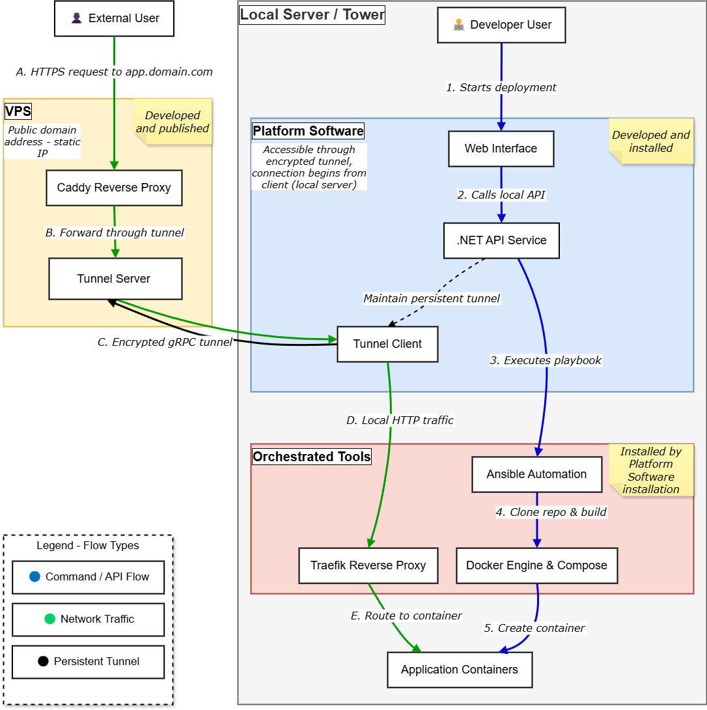

Este proyecto aborda el principal desafío del *self-hosting*: la complejidad de la conectividad de red. El objetivo es proporcionar una experiencia similar a una PaaS (Plataforma como Servicio) en hardware personal, permitiendo a los desarrolladores desplegar aplicaciones desde una red doméstica y obtener una URL pública de forma automatizada y segura.

## Arquitectura

El sistema se basa en un patrón de túnel inverso desacoplado:

1.  **Broker (VPS):** Un servicio público que actúa como punto de entrada. Su función es autenticar agentes y enrutar peticiones a través de túneles seguros. No procesa ni almacena los datos de las aplicaciones.
2.  **Agent (Servidor Local):** Un servicio ligero que se ejecuta en el hardware del usuario. Inicia una conexión de salida persistente hacia el Broker, recibe las peticiones y las dirige a los contenedores Docker locales a través de un reverse proxy interno.

## Pila Tecnológica

| Capa | Tecnología | Propósito |
| :--- | :--- | :--- |
| **Backend** | .NET 8 | Servicios Broker y Agent. |
| **Protocolo** | gRPC (Streaming) | Túnel de comunicación persistente y de alto rendimiento. |
| **Seguridad** | mTLS | Autenticación criptográfica mutua entre Broker y Agent. |
| **Contenerización**| Docker | Aislamiento y ejecución de aplicaciones. |
| **Proxy Público** | Caddy Server | Terminación TLS y gestión automática de certificados. |
| **Proxy Local** | Traefik | Enrutamiento interno y descubrimiento de servicios Docker. |
| **Orquestación** | Ansible | Automatización de despliegues complejos desde repositorios. |
| **UI/Gestión** | Blazor Server | Dashboard para la administración de aplicaciones. |

## Quick Start

### Requisitos

- Un dominio DNS.
- Un servidor VPS con IP pública.
- Un servidor local con sistema operativo Linux.

### 1. Despliegue del Broker (VPS)

1.  Clonar el repositorio en el VPS.
2.  Configurar las variables de entorno en `docker/vps/.env` (dominio, contraseñas).
3.  Ejecutar `docker compose -f docker/vps/docker-compose.yml up -d`.

### 2. Instalación del Agent (Servidor Local)

1.  Transferir los scripts de instalación al servidor local.
2.  Ejecutar el script `scripts/setup-local.sh`. Este se encargará de:
    - Instalar Docker y Traefik.
    - Configurar los directorios y certificados necesarios.
    - Desplegar el servicio del Agent.

### 3. Despliegue de Aplicaciones

1.  Acceder al Dashboard local en `http://<IP_LOCAL>:5500`.
2.  Utilizar la interfaz para desplegar nuevas aplicaciones desde templates predefinidos o repositorios Git. El sistema gestionará automáticamente la configuración de red y el enrutamiento.

## Estructura del Repositorio

Este es un monorepo que contiene todos los artefactos del proyecto.

-   `src/`: Código fuente de los servicios .NET.
    -   `TFM.Contracts/`: Definiciones del protocolo gRPC.
    -   `TFM.Broker/`: Implementación del servicio Broker.
    -   `TFM.Agent/`: Implementación del servicio Agent.
    -   `TFM.Dashboard/`: Interfaz web de gestión.
-   `docker/`: Archivos `Dockerfile` y `docker-compose.yml` para cada componente.
-   `ansible/`: Playbooks para la automatización de despliegues.
-   `scripts/`: Scripts de utilidad (generación de certificados, despliegue, etc.).
-   `docs/`: Documentación técnica y diagramas de arquitectura.

