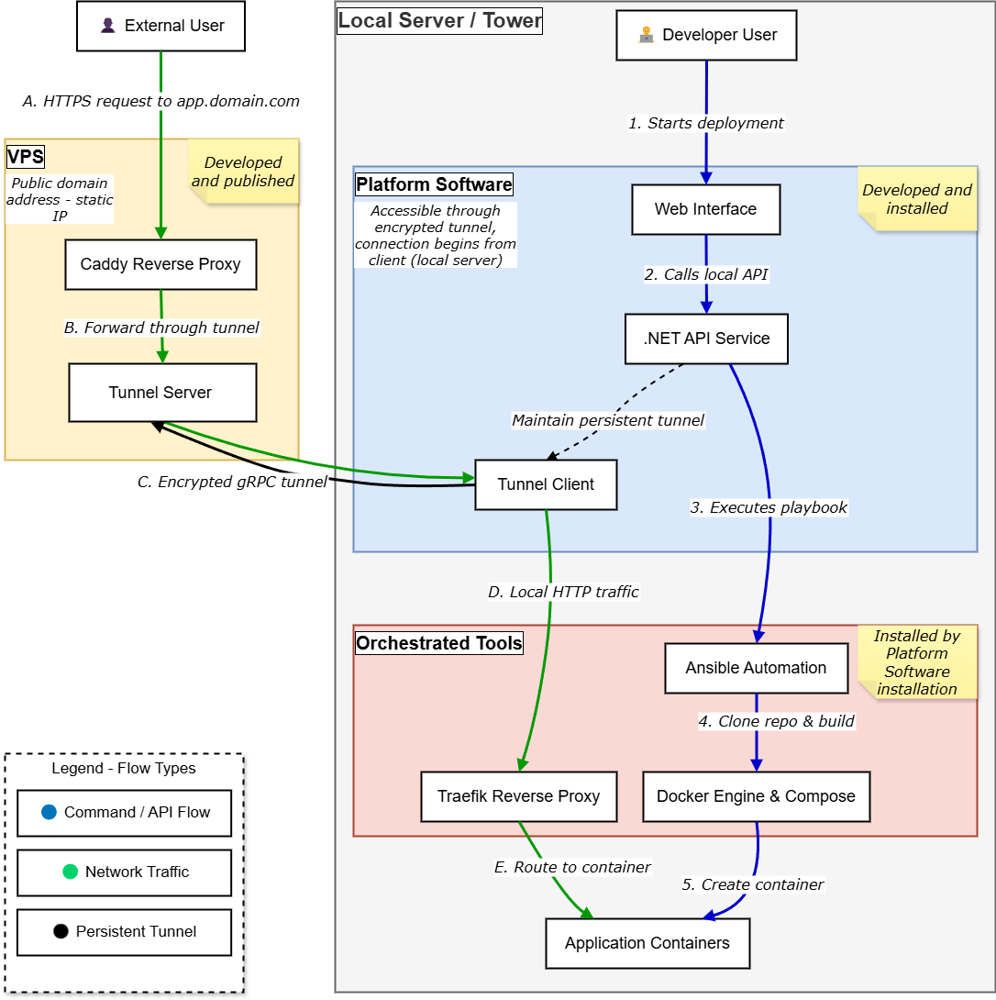

# TFM Self-Hosting Platform

Este proyecto aborda el principal desafio del *self-hosting*: la complejidad de la conectividad de red. El objetivo es proporcionar una experiencia similar a una PaaS (Plataforma como Servicio) en hardware personal, permitiendo a los desarrolladores desplegar aplicaciones desde una red doméstica y obtener una URL pública de forma automatizada y segura.

## Arquitectura

El sistema se basa en un patrón de túnel inverso desacoplado:

1.  **Broker (VPS):** Un servicio público que actúa como punto de entrada. Su función es autenticar agentes y enrutar peticiones a través de túneles seguros. No procesa ni almacena los datos de las aplicaciones.
2.  **Agent (Servidor Local):** Un servicio ligero que se ejecuta en el hardware del usuario. Inicia una conexión de salida persistente hacia el Broker, recibe las peticiones y las dirige a los contenedores Docker locales a través de un reverse proxy interno.



## Pila Tecnológica

| Capa | Tecnología | Propósito |
| :--- | :--- | :--- |
| **Backend** | .NET 8 | Servicios Broker y Agent. |
| **Protocolo** | gRPC (Streaming) | Túnel de comunicación persistente y de alto rendimiento. |
| **Seguridad** | mTLS | Autenticación criptográfica mutua entre Broker y Agent. |
| **Contenerización**| Docker | Aislamiento y ejecución de aplicaciones. |
| **Proxy Público** | Caddy Server | Terminación TLS y gestión automática de certificados. |
| **Proxy Local** | Traefik | Enrutamiento interno y descubrimiento de servicios Docker. |
| **Orquestación** | Ansible | Automatización de despliegues complejos desde repositorios. |
| **UI/Gestión** | Blazor Server | Dashboard para la administración de aplicaciones. |

## Requisitos Previos

- Una **máquina de desarrollo** (puede ser tu portátil) con `openssl`, `git` y `ssh`.
- Un **servidor VPS** con IP pública (Ubuntu 24.04 recomendado) y Docker instalado.
- Un **servidor local** (torre) con Ubuntu/Debian y Docker instalado.
- Un **dominio DNS** apuntando a la IP de tu VPS (con wildcard `*.tudominio.com`).

## Despliegue Completo Paso a Paso

> **IMPORTANTE — Principio fundamental del despliegue:**
>
> Los secretos y certificados se generan **UNA SOLA VEZ** en la máquina de desarrollo.
> Desde ahí se distribuyen al VPS y a la Torre. **Nunca** ejecutes `generate-secrets.sh`
> ni `generate-certs.sh` por separado en cada máquina, ya que generarían claves distintas
> y la autenticación mTLS fallaría.

### Paso 1: Clonar el repositorio (en tu máquina de desarrollo)

```bash
git clone https://github.com/MagdaOnaindia/tfm-selfhosting.git
cd tfm-selfhosting
```

### Paso 2: Generar secretos y certificados (en tu máquina de desarrollo)

```bash
# Genera contraseñas aleatorias
./scripts/generate-secrets.sh

# Genera la CA raíz y los certificados mTLS (Broker + Agent)
./scripts/generate-certs.sh
```

Esto crea:

| Archivo | Contenido |
| :--- | :--- |
| `docker/broker/.env` | `BROKER_CERT_PASSWORD`, `ADMIN_API_KEY` y sus equivalentes .NET |
| `docker/agent/.env` | `AGENT_CERT_PASSWORD` |
| `certs/ca.crt` | Certificado raíz de la CA (público) |
| `certs/ca.key` | Clave privada de la CA (no se distribuye) |
| `certs/broker.pfx` | Certificado + clave del Broker (protegido por contraseña) |
| `certs/agent.pfx` | Certificado + clave del Agent (protegido por contraseña) |

> **Nota:** Ambos `.pfx` están cifrados con la **misma contraseña** (generada por `generate-secrets.sh`).
> Puedes consultarla con: `cat docker/agent/.env`

### Paso 3: Desplegar el Broker en el VPS

**Opción A: Script automático** (desde tu máquina de desarrollo):

```bash
./scripts/deploy-broker.sh usuario@IP_DEL_VPS
```

**Opción B: Manual**:

```bash
# 1. En el VPS, clonar el repositorio:
ssh usuario@IP_DEL_VPS
git clone https://github.com/MagdaOnaindia/tfm-selfhosting.git
exit

# 2. Desde tu máquina de desarrollo, copiar secretos y certificados al VPS:
scp docker/broker/.env usuario@IP_DEL_VPS:~/tfm-selfhosting/docker/broker/.env
scp certs/ca.crt usuario@IP_DEL_VPS:~/tfm-selfhosting/certs/
scp certs/broker.pfx usuario@IP_DEL_VPS:~/tfm-selfhosting/certs/

# 3. IMPORTANTE: Permisos para el contenedor (usuario no-root).
ssh usuario@IP_DEL_VPS "chmod 644 ~/tfm-selfhosting/certs/broker.pfx ~/tfm-selfhosting/certs/ca.crt"
# El directorio config debe ser escribible para el registro automatico de dominios:
ssh usuario@IP_DEL_VPS "chmod 777 ~/tfm-selfhosting/config/ && chmod 666 ~/tfm-selfhosting/config/domains.json"

# 4. En el VPS, levantar los servicios:
ssh usuario@IP_DEL_VPS "cd ~/tfm-selfhosting && docker compose -f docker/vps-complete.yml up -d --build"
```

**Verificar que el Broker funciona:**

```bash
ssh usuario@IP_DEL_VPS "docker logs tfm-broker --tail 20"
# Debe mostrar:
#   Now listening on: https://[::]:50051
#   Now listening on: http://localhost:5000
```

### Paso 4: Configurar el dominio DNS

En tu proveedor DNS (Cloudflare, etc.), crear los siguientes registros apuntando a la IP de tu VPS:

| Tipo | Nombre | Valor | Proxy |
|:-----|:-------|:------|:------|
| A | `tudominio.com` | `IP_DEL_VPS` | DNS only (gris) |
| A | `*.tudominio.com` | `IP_DEL_VPS` | DNS only (gris) |

> **Importante — Cloudflare:** Usa modo **DNS only** (icono gris, no naranja). Caddy necesita recibir las conexiones TLS directamente para obtener certificados Let's Encrypt. Si usas el proxy de Cloudflare, Caddy no podra completar el challenge HTTP-01.

Actualizar `docker/caddy/Caddyfile` con tu dominio real (reemplazar `ejemplo.com` por tu dominio).

### Paso 5: Instalar el Agent en la Torre Local

**Opcion A: Script automatico** (ejecutar en la torre):

```bash
git clone https://github.com/MagdaOnaindia/tfm-selfhosting.git
cd tfm-selfhosting
./scripts/setup-local-tower.sh
```

El script se encargara de instalar dependencias, copiar certificados, pedir la IP del VPS, y levantar los servicios.

**Opcion B: Manual paso a paso:**

#### 5.1. En la Torre — Clonar repositorio e instalar Docker

```bash
# Conectar por SSH a la torre
ssh usuario@IP_DE_LA_TORRE

# Clonar el repositorio
git clone https://github.com/MagdaOnaindia/tfm-selfhosting.git
cd tfm-selfhosting

# Instalar Docker si no esta instalado
curl -fsSL https://get.docker.com | sh
sudo usermod -aG docker $USER
# IMPORTANTE: cerrar sesion y volver a entrar para que los permisos surtan efecto
```

#### 5.2. Desde la maquina de desarrollo — Copiar secretos y certificados a la Torre

> **Este es el paso clave.** Los archivos deben venir de la misma maquina donde se generaron
> (Paso 2), para que la CA, los certificados y las contrasenas sean coherentes.

```bash
# Desde tu maquina de desarrollo (NO desde la torre):
scp docker/agent/.env usuario@IP_TORRE:~/tfm-selfhosting/docker/agent/.env
scp certs/agent.pfx usuario@IP_TORRE:~/tfm-selfhosting/certs/
scp certs/ca.crt usuario@IP_TORRE:~/tfm-selfhosting/certs/
```

#### 5.3. En la Torre — Crear estructura y copiar certificados

```bash
# Crear estructura de directorios
sudo mkdir -p /opt/selfhosting/{certs,config,apps,data,traefik/dynamic,logs}
sudo chown -R $USER:$USER /opt/selfhosting
sudo chmod -R 777 /opt/selfhosting/data /opt/selfhosting/apps /opt/selfhosting/traefik

# Copiar certificados a la ruta que usa el contenedor
sudo cp ~/tfm-selfhosting/certs/agent.pfx /opt/selfhosting/certs/
sudo cp ~/tfm-selfhosting/certs/ca.crt /opt/selfhosting/certs/

# IMPORTANTE: Permisos 644 (no 600) porque el contenedor se ejecuta como usuario no-root
sudo chmod 644 /opt/selfhosting/certs/agent.pfx
sudo chmod 644 /opt/selfhosting/certs/ca.crt
```

#### 5.4. En la Torre — Crear configuracion del Agent

```bash
# Leer la contrasena del certificado (copiada en el paso 5.2)
cat ~/tfm-selfhosting/docker/agent/.env
# Toma nota del valor de AGENT_CERT_PASSWORD

# Crear appsettings.Production.json
# REEMPLAZA los dos valores marcados: IP_DEL_VPS y TU_CERT_PASSWORD
sudo tee /opt/selfhosting/config/appsettings.Production.json << 'EOF'
{
  "Agent": {
    "AgentId": "my-agent",
    "BrokerUrl": "https://IP_DEL_VPS:50051",
    "CertificatePath": "/opt/selfhosting/certs/agent.pfx",
    "CertificatePassword": "TU_CERT_PASSWORD",
    "CaCertPath": "/opt/selfhosting/certs/ca.crt",
    "TraefikUrl": "http://traefik:80"
  }
}
EOF
```

> **Atencion:** Reemplaza `IP_DEL_VPS` con la IP real de tu VPS y `TU_CERT_PASSWORD`
> con el valor exacto de `AGENT_CERT_PASSWORD` que obtuviste del paso anterior.
> El delimitador `EOF` de cierre debe estar **solo en su linea, sin espacios delante**.

#### 5.5. En la Torre — Crear .env para Docker Compose

```bash
# Leer la contrasena del certificado
CERT_PASS=$(grep AGENT_CERT_PASSWORD ~/tfm-selfhosting/docker/agent/.env | cut -d= -f2)

# Leer la API Key del Broker (debe coincidir con la del VPS)
API_KEY=$(grep ADMIN_API_KEY ~/tfm-selfhosting/docker/broker/.env | head -1 | cut -d= -f2)

# Obtener el GID del grupo docker
DOCKER_GID=$(getent group docker | cut -d: -f3)

# Crear el archivo .env
# REEMPLAZA tudominio.com con tu dominio real
cat > ~/tfm-selfhosting/docker/.env << EOF
AGENT_CERT_PASSWORD=${CERT_PASS}
ADMIN_API_KEY=${API_KEY}
BROKER_ADMIN_URL=https://api.tudominio.com
AGENT_ID=my-agent
DOCKER_GID=${DOCKER_GID}
EOF
```

> **Nota:** La variable `BROKER_ADMIN_URL` permite al Dashboard registrar dominios automaticamente en el Broker al desplegar aplicaciones. Puede ser cualquier subdominio de tu dominio (Caddy enruta todos al Broker). Si no se configura, los dominios deben registrarse manualmente via SSH.

#### 5.6. En la Torre — Abrir puertos en el firewall

```bash
# El firewall (UFW) bloquea todo el trafico entrante excepto SSH por defecto.
# Hay que abrir los puertos del Dashboard y Traefik:
sudo ufw allow 5500/tcp   # Dashboard web
sudo ufw allow 80/tcp     # Traefik HTTP
sudo ufw allow 8080/tcp   # Traefik API
```

#### 5.7. En la Torre — Levantar los servicios

```bash
cd ~/tfm-selfhosting
docker compose -f docker/local-stack-complete.yml up -d --build
```

#### 5.8. Verificar que el Agent funciona

```bash
# Esperar 15 segundos y comprobar logs
sleep 15
docker logs selfhosting-agent --tail 30

# Debe mostrar:
#   Agent ID: my-agent
#   Broker URL: https://IP_DEL_VPS:50051
#   Client certificate loaded         <-- Certificados OK
#   CA certificate loaded             <-- CA OK
#   Ping successful                   <-- Conexion al Broker OK
#   Tunnel established successfully
#   Agent is ONLINE and ready to receive requests
```

#### 5.9. En la Torre — Crear la red traefik-net

Las aplicaciones desplegadas usan una red Docker compartida llamada `traefik-net`. Debe crearse antes del primer despliegue:

```bash
docker network create traefik-net
```

### Paso 6: Desplegar Aplicaciones

Acceder al Dashboard local en `http://IP_DE_TU_TORRE:5500`.

#### 6.1. Desde Templates (Nextcloud, Gitea, WordPress, etc.)

1. Ir a **Desplegar Nueva App** (`/deploy`).
2. Seleccionar una plantilla, configurar nombre, dominio y variables de entorno.
3. Click en **Desplegar Ahora**.

#### 6.2. App Personalizada (cualquier imagen Docker)

1. Ir a **App Personalizada** (`/deploy/custom`).
2. En la pestana **Imagen Docker**: introducir el nombre de la imagen (ej: `louislam/uptime-kuma:1`), nombre, dominio y puerto.
3. En la pestana **Docker Compose**: pegar un `docker-compose.yml` completo.
4. Click en **Desplegar**.

#### 6.3. Registrar el dominio en DNS y en el Broker

Tras desplegar una aplicacion desde el Dashboard, hay que completar **dos pasos adicionales** para que sea accesible desde Internet:

**Paso A — Crear registro DNS en Cloudflare (o tu proveedor):**

| Tipo | Nombre | Valor | Proxy |
|:-----|:-------|:------|:------|
| A | `subdominio` | `IP_DEL_VPS` | DNS only (gris) |

Por ejemplo, para `tools.tudominio.com` crear un registro A con nombre `tools`.

**Paso B — Registrar la ruta en el Broker (VPS):**

El Broker necesita saber que dominio corresponde a que agente y puerto. Editar `config/domains.json` en el VPS:

```bash
ssh usuario@IP_DEL_VPS
nano ~/tfm-selfhosting/config/domains.json
```

Anadir la nueva ruta al JSON:

```json
{
  "Routes": {
    "app-existente.tudominio.com": {
      "AgentId": "my-agent",
      "TargetPort": 80,
      "Description": "App existente"
    },
    "nuevo-subdominio.tudominio.com": {
      "AgentId": "my-agent",
      "TargetPort": 3001,
      "Description": "Mi nueva app"
    }
  }
}
```

> **Importante:** El `TargetPort` debe coincidir con el puerto interno del contenedor (el que se indica en el Dashboard al desplegar).

Despues, recargar las rutas sin reiniciar el Broker:

```bash
curl -X POST http://localhost:5000/admin/reload-routes \
  -H "X-API-Key: $(grep ADMIN_API_KEY ~/tfm-selfhosting/docker/broker/.env | cut -d= -f2)"
```

Debe devolver `{"message":"Routes reloaded"}`.

#### 6.4. Verificar el despliegue

1. Esperar ~30 segundos (Caddy obtiene el certificado TLS automaticamente en la primera peticion).
2. Acceder a `https://subdominio.tudominio.com` en el navegador.
3. Si hay problemas, comprobar los logs:

```bash
# En la Torre — Agent:
docker logs selfhosting-agent --tail 20

# En el VPS — Broker:
docker logs tfm-broker --tail 20

# En el VPS — Caddy:
docker logs selfhosting-caddy --tail 20
```

#### 6.5. Que ocurre internamente al desplegar

El Dashboard ejecuta automaticamente en la torre:

1. Genera y guarda el archivo `docker-compose.yml` en `/opt/selfhosting/apps/{nombre}/`.
2. Crea la configuracion dinamica de Traefik (fichero YAML en `/opt/selfhosting/traefik/dynamic/`).
3. Ejecuta `docker compose up -d` y conecta el contenedor a la red `traefik-net`.
4. Sincroniza el estado con Docker y guarda en `apps.json`.

> **Nota sobre registro automatico:** El Dashboard intenta registrar el dominio en el Broker automaticamente via `POST /admin/routes`. Para que funcione, `ADMIN_API_KEY` y `BROKER_ADMIN_URL` deben estar configurados en el `.env` de la torre (Paso 5.5) y el subdominio `api.tudominio.com` debe tener un registro DNS apuntando al VPS. Si no estan configurados, el despliegue funciona igualmente pero el dominio debe registrarse manualmente (Paso 6.3B).

#### 6.6. Ejemplo completo: desplegar IT-Tools

1. **Dashboard** → App Personalizada → Imagen Docker:
   - Nombre: `it-tools`
   - Imagen: `corentinth/it-tools:latest`
   - Dominio: `tools.tudominio.com`
   - Puerto: `80`
   - Click **Desplegar**

2. **Cloudflare** → Anadir registro A:
   - Nombre: `tools`, Valor: `IP_DEL_VPS`, Proxy: DNS only

3. **VPS** → Registrar ruta:
   ```bash
   # Editar domains.json y anadir:
   "tools.tudominio.com": {
     "AgentId": "my-agent",
     "TargetPort": 80,
     "Description": "IT-Tools"
   }

   # Recargar
   curl -X POST http://localhost:5000/admin/reload-routes \
     -H "X-API-Key: $(grep ADMIN_API_KEY ~/tfm-selfhosting/docker/broker/.env | cut -d= -f2)"
   ```

4. Acceder a `https://tools.tudominio.com`

## Solucion de Problemas

Esta seccion documenta todos los problemas encontrados durante el despliegue real del sistema y sus soluciones.

---

### 1. `BIO routines::system lib` — Contenedor no puede leer certificados

**Causa:** Los contenedores del Broker y del Agent se ejecutan como usuarios no-root (`broker` y `agent` respectivamente). Si los archivos `.pfx` o `.crt` tienen permisos `600` (solo lectura para root), el proceso dentro del contenedor no puede abrirlos. OpenSSL devuelve `BIO routines::system lib` en vez de un error de permisos claro.

**Diagnostico:**

```bash
# Verificar permisos en el host
ls -la /opt/selfhosting/certs/          # Torre
ls -la ~/tfm-selfhosting/certs/         # VPS

# Verificar que el contenedor ve los archivos
docker exec selfhosting-agent ls -la /opt/selfhosting/certs/    # Torre
docker exec tfm-broker ls -la /app/certs/                       # VPS

# Verificar que usuario ejecuta el contenedor
docker exec selfhosting-agent whoami    # debe decir "agent"
docker exec tfm-broker whoami           # debe decir "broker"
```

**Solucion:**

```bash
# En la Torre:
sudo chmod 644 /opt/selfhosting/certs/agent.pfx
sudo chmod 644 /opt/selfhosting/certs/ca.crt

# En el VPS:
chmod 644 ~/tfm-selfhosting/certs/broker.pfx
chmod 644 ~/tfm-selfhosting/certs/ca.crt

# Reiniciar despues de cambiar permisos:
docker compose -f docker/local-stack-complete.yml restart agent      # Torre
docker compose -f docker/vps-complete.yml restart broker             # VPS
```

> **Regla:** Todos los certificados montados en contenedores deben tener permisos **644**, no 600.
> Los archivos `.pfx` estan protegidos por contrasena, lo que compensa el permiso de lectura abierto.

---

### 2. `Certificate password is incorrect` — Contrasena no coincide con el .pfx

**Causa:** La contrasena en `appsettings.Production.json` (Agent) o en `docker/broker/.env` (Broker) no coincide con la que se uso al generar el archivo `.pfx`. Esto ocurre cuando:
- Se generaron secretos por separado en la torre y en la maquina de desarrollo (contrasenas distintas).
- Se copio el `.pfx` desde la maquina de desarrollo pero se uso la contrasena generada localmente en la torre.

**Diagnostico:**

```bash
# Ver la contrasena correcta (la que se uso al generar los certs):
cat ~/tfm-selfhosting/docker/agent/.env    # Torre - AGENT_CERT_PASSWORD
cat ~/tfm-selfhosting/docker/broker/.env   # VPS - BROKER_CERT_PASSWORD

# Ver la contrasena que esta usando el Agent:
cat /opt/selfhosting/config/appsettings.Production.json | grep CertificatePassword
cat ~/tfm-selfhosting/docker/.env

# Todas deben mostrar el MISMO valor
```

**Solucion:** Actualizar la contrasena incorrecta para que coincida con la del `.env` copiado desde la maquina de desarrollo, y reiniciar.

---

### 3. `NotSignatureValid` / `UntrustedRoot` — Certificados de CAs distintas

**Causa:** Los certificados del Agent y del Broker fueron firmados por **Autoridades Certificadoras (CA) distintas**. Esto ocurre cuando `generate-certs.sh` se ejecuto por separado en cada maquina. Cada ejecucion crea una CA nueva con claves distintas.

**Diagnostico:** Comparar los fingerprints de la CA en cada maquina:

```bash
# En la maquina de desarrollo:
openssl x509 -in certs/ca.crt -noout -fingerprint -sha256

# En el VPS:
openssl x509 -in ~/tfm-selfhosting/certs/ca.crt -noout -fingerprint -sha256

# En la Torre:
openssl x509 -in /opt/selfhosting/certs/ca.crt -noout -fingerprint -sha256

# Los tres fingerprints DEBEN ser identicos
```

**Solucion:** Re-distribuir los certificados correctos desde la maquina de desarrollo:

```bash
# Desde la maquina de desarrollo:
scp certs/ca.crt certs/broker.pfx usuario@IP_VPS:~/tfm-selfhosting/certs/
scp certs/ca.crt certs/agent.pfx usuario@IP_TORRE:~/tfm-selfhosting/certs/

# En el VPS:
chmod 644 ~/tfm-selfhosting/certs/*
docker compose -f docker/vps-complete.yml restart broker

# En la Torre:
sudo cp ~/tfm-selfhosting/certs/{agent.pfx,ca.crt} /opt/selfhosting/certs/
sudo chmod 644 /opt/selfhosting/certs/*
docker compose -f docker/local-stack-complete.yml restart agent
```

---

### 4. Docker Compose `context` y rutas relativas — Build falla con `not found`

**Causa:** Docker Compose V2 resuelve **todas las rutas relativas desde la ubicacion del archivo compose**, no desde el directorio de trabajo actual. Como `vps-complete.yml` esta en `docker/`, una ruta como `context: .` apunta a `docker/` (no a la raiz del repositorio).

**Ejemplo del error:**

```
lstat /root/tfm-selfhosting/docker/docker: no such file or directory
```

**Solucion aplicada en `docker/vps-complete.yml`:**

```yaml
# INCORRECTO (resuelve a docker/docker/broker/Dockerfile):
build:
  context: .
  dockerfile: docker/broker/Dockerfile

# CORRECTO (sube un nivel a la raiz del repo):
build:
  context: ..
  dockerfile: docker/broker/Dockerfile
```

Lo mismo aplica para volumenes:

```yaml
# INCORRECTO:          CORRECTO:
./docker/caddy/       ./caddy/          # ya estamos en docker/
./certs               ../certs          # subir a la raiz
./config              ../config         # subir a la raiz
```

---

### 5. Docker Compose `env_file` vs `${VAR}` — Variables no se interpolan

**Causa:** `env_file` carga variables dentro del **contenedor en tiempo de ejecucion**. Pero la sintaxis `${VARIABLE}` en la seccion `environment:` se interpola en **tiempo de parseo** por Docker Compose, que busca las variables en el shell o en un archivo `.env` junto al compose file. Son dos mecanismos distintos.

**Ejemplo del problema:**

```yaml
env_file:
  - ./broker/.env           # Carga BROKER_CERT_PASSWORD dentro del contenedor
environment:
  - MY_VAR=${BROKER_CERT_PASSWORD}   # Compose intenta interpolar AHORA, no la encuentra -> vacio
```

**Solucion aplicada:** El archivo `docker/broker/.env` incluye las variables tanto en formato estandar como en formato .NET (con `__`):

```
BROKER_CERT_PASSWORD=xxx
Certificates__BrokerCertPassword=xxx
ADMIN_API_KEY=yyy
Security__AdminApiKey=yyy
```

Y el compose file usa solo `env_file` sin interpolacion `${...}`:

```yaml
env_file:
  - ./broker/.env
environment:
  - ASPNETCORE_ENVIRONMENT=Production
  - ASPNETCORE_URLS=http://+:5000
```

---

### 6. `Broker URL: https://YOUR_VPS_IP:50051` — Config de produccion no cargada

**Causa:** El archivo `appsettings.Production.json` no esta montado en la ruta correcta dentro del contenedor. El Agent busca el archivo en `/app/appsettings.Production.json`.

**Diagnostico:**

```bash
# Verificar que el archivo existe en la ruta correcta del host
cat /opt/selfhosting/config/appsettings.Production.json

# Verificar que el contenedor lo ve
docker exec selfhosting-agent cat /app/appsettings.Production.json
```

**Solucion:** El volumen en `docker/local-stack-complete.yml` debe montar el archivo directamente en `/app/`:

```yaml
volumes:
  - /opt/selfhosting/config/appsettings.Production.json:/app/appsettings.Production.json:ro
```

---

### 7. Dashboard no accesible en el navegador — Firewall bloqueando puertos

**Causa:** El script `setup-local-tower.sh` configura UFW con politica `deny incoming` por defecto y solo permite SSH. Los puertos del Dashboard (5500), Traefik (80, 8080) quedan bloqueados.

**Diagnostico:**

```bash
sudo ufw status
# Si muestra solo "22/tcp ALLOW" y politica "deny (incoming)", los puertos estan bloqueados
```

**Solucion:**

```bash
sudo ufw allow 5500/tcp   # Dashboard web
sudo ufw allow 80/tcp     # Traefik HTTP (para apps)
sudo ufw allow 8080/tcp   # Traefik API (opcional, para debug)
```

Despues, acceder al Dashboard en `http://IP_DE_TU_TORRE:5500`.

---

### 8. Broker `Connection reset by peer` en healthcheck

**Causa:** El Broker usa `ListenLocalhost(5000)` en Kestrel, que escucha en `127.0.0.1` **dentro del contenedor**. Pero las conexiones de Docker (port forwarding, healthcheck desde otro contenedor) llegan desde la red bridge de Docker, no desde localhost. El contenedor rechaza la conexion.

**Diagnostico:**

```bash
# Desde el VPS host:
curl http://localhost:5000/health
# Resultado: "Connection reset by peer"

# Desde DENTRO del contenedor (funciona porque es localhost real):
docker exec tfm-broker curl -f http://localhost:5000/health
```

**Nota:** Este error **no afecta al tunel gRPC** (puerto 50051 usa `ListenAnyIP` y funciona correctamente). Solo afecta al healthcheck de Docker y a la comunicacion con Caddy.

---

### 9. Dashboard `Connection reset by peer` en puerto 5500

**Causa:** El Dashboard de Blazor escucha en el puerto 8080 dentro del contenedor (puerto por defecto de .NET 8 en modo Production), pero el archivo compose mapeaba `5500:80`.

**Diagnostico:**

```bash
# Desde el host de la Torre:
curl http://localhost:5500
# Resultado: "Connection reset by peer"

# Verificar en que puerto escucha el contenedor internamente:
docker exec selfhosting-dashboard printenv ASPNETCORE_URLS
# Debe mostrar http://+:8080
```

**Solucion:** Cambiar el mapeo de puertos en `docker/local-stack-complete.yml`:

```yaml
# INCORRECTO:
ports:
  - "5500:80"

# CORRECTO:
ports:
  - "5500:8080"
```

Reiniciar el stack despues del cambio:

```bash
docker compose -f docker/local-stack-complete.yml up -d --build --force-recreate
```

---

### 10. Dashboard crash — `Access to the path '/opt/selfhosting' is denied`

**Causa:** El archivo `appsettings.json` del Dashboard usa rutas como `/opt/selfhosting/...` dentro del contenedor, pero el archivo compose montaba los volumenes en rutas `/app/...`. El servicio `TraefikConfigService` intenta crear el directorio `/opt/selfhosting/traefik/dynamic` dentro del contenedor y el usuario no-root `dashboard` no tiene permisos para hacerlo.

**Diagnostico:**

```bash
# Ver los logs del Dashboard:
docker logs selfhosting-dashboard --tail 30
# Mostrara: "Access to the path '/opt/selfhosting' is denied"

# Verificar que usuario ejecuta el contenedor:
docker exec selfhosting-dashboard whoami
# Debe decir "dashboard" (usuario no-root)

# Verificar los volumenes montados:
docker inspect selfhosting-dashboard | grep -A5 Mounts
```

**Solucion:** Montar `/opt/selfhosting:/opt/selfhosting` como un unico volumen en el compose para que las rutas coincidan, y asignar permisos amplios en los directorios de datos:

```yaml
# En docker/local-stack-complete.yml, seccion dashboard volumes:
volumes:
  - /opt/selfhosting:/opt/selfhosting
```

En el host de la Torre:

```bash
sudo chmod -R 777 /opt/selfhosting/data /opt/selfhosting/apps /opt/selfhosting/traefik
docker compose -f docker/local-stack-complete.yml up -d --build --force-recreate
```

---

### 11. Dashboard `Failed to start a process with file path 'docker'` — Docker CLI no instalado

**Causa:** El Dashboard necesita ejecutar comandos `docker compose` via CliWrap para desplegar aplicaciones. La imagen base `aspnet:8.0` no incluye el binario `docker`. Aunque el socket Docker este montado (`/var/run/docker.sock`), sin el CLI no se puede interactuar con el.

**Solucion:** El Dockerfile del Dashboard (`src/TFM.Dashboard/Dockerfile`) debe instalar `docker-ce-cli` y `docker-compose-plugin`. Esto ya esta incluido en la version actual. Si tienes una imagen antigua, reconstruye:

```bash
cd ~/tfm-selfhosting
docker compose -f docker/local-stack-complete.yml up -d --build --force-recreate dashboard
```

Ademas, el usuario del contenedor debe tener acceso al socket Docker. El compose file usa `group_add` con el GID del grupo `docker` del host:

```bash
# Obtener el GID correcto y ponerlo en docker/.env
DOCKER_GID=$(getent group docker | cut -d: -f3)
echo "DOCKER_GID=${DOCKER_GID}" >> ~/tfm-selfhosting/docker/.env
```

---

### Reiniciar los servicios tras cambios

```bash
# En el VPS (Broker):
cd ~/tfm-selfhosting
docker compose -f docker/vps-complete.yml up -d --build --force-recreate

# En la Torre (Agent):
cd ~/tfm-selfhosting
docker compose -f docker/local-stack-complete.yml up -d --build --force-recreate
```

### Checklist de verificacion rapida

```bash
# 1. Permisos de certificados (todos deben ser 644):
ls -la /opt/selfhosting/certs/         # Torre
ls -la ~/tfm-selfhosting/certs/        # VPS

# 2. Fingerprint de la CA (debe ser identico en las 3 maquinas):
openssl x509 -in <ruta>/ca.crt -noout -fingerprint -sha256

# 3. Contrasenas (deben coincidir):
cat ~/tfm-selfhosting/docker/agent/.env                            # Torre
cat /opt/selfhosting/config/appsettings.Production.json            # Torre
cat ~/tfm-selfhosting/docker/.env                                  # Torre
cat ~/tfm-selfhosting/docker/broker/.env                           # VPS

# 4. Contenedores corriendo:
docker ps                              # Torre: traefik, agent, dashboard
docker ps                              # VPS: caddy, broker

# 5. Agent conectado:
docker logs selfhosting-agent --tail 5  # Debe mostrar "Heartbeat sent"

# 6. Firewall (Torre):
sudo ufw status                        # Debe mostrar 22, 80, 5500, 8080 ALLOW
```

## Validacion de Seguridad

Ejecutar el script de auditoria para verificar la configuracion:

```bash
./scripts/validate-security.sh
```

Comprueba: permisos de certificados, ausencia de contrasenas hardcodeadas, `.gitignore` completo, Dockerfiles con usuario no-root, y AdminApiKey configurada.

## Estructura del Repositorio

```
tfm-selfhosting/
├── src/                          # Codigo fuente .NET
│   ├── TFM.Contracts/            # Definiciones gRPC (tunnel.proto) y modelos
│   ├── TFM.Broker/               # Servidor gRPC + proxy HTTP (VPS)
│   ├── TFM.Agent/                # Cliente gRPC + proxy local (Torre)
│   └── TFM.Dashboard/            # Interfaz web Blazor Server
├── docker/
│   ├── vps-complete.yml          # Stack VPS: Caddy + Broker
│   ├── local-stack-complete.yml  # Stack Local: Traefik + Agent + Dashboard
│   ├── broker/                   # Dockerfile y config del Broker
│   ├── caddy/                    # Caddyfile
│   └── local/                    # Config standalone del Agent
├── scripts/
│   ├── generate-secrets.sh       # Genera .env con contrasenas aleatorias
│   ├── generate-certs.sh         # Genera CA + certificados mTLS
│   ├── deploy-broker.sh          # Despliega el Broker en el VPS via SSH
│   ├── setup-local-tower.sh      # Wizard de configuracion de la torre
│   ├── setup-agent.sh            # Instalacion alternativa con systemd
│   └── validate-security.sh      # Auditoria de seguridad
├── ansible/playbooks/            # Playbooks para estructura y firewall
├── config/domains.json           # Mapeo de dominios a agentes
├── certs/                        # Certificados generados (excluidos de Git)
└── docs/diagrams/                # Diagramas de arquitectura
```
